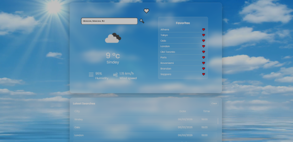
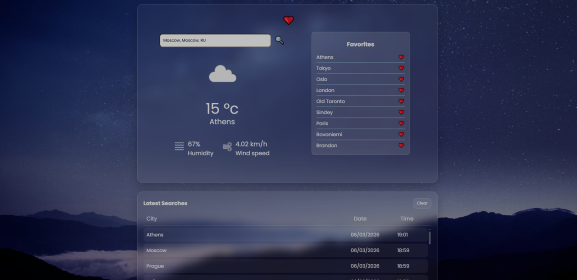
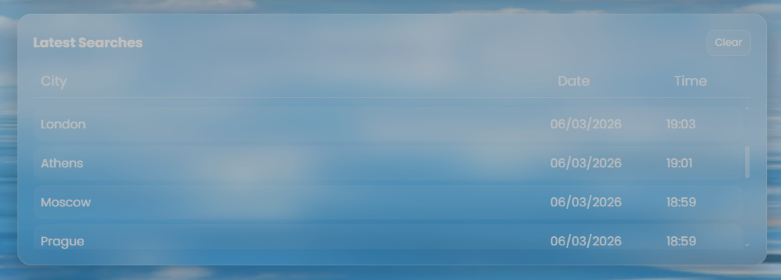
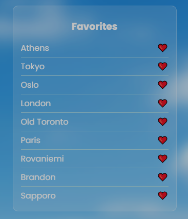
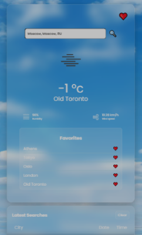
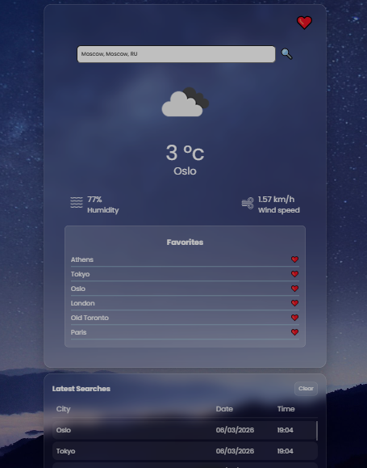

# 🌦 WeatherApp

A modern **React + Vite weather application** that allows users to search for cities and view current weather conditions using the **OpenWeather API**.

The application provides a clean user interface and includes features such as **favorites, search history, offline caching**, and **dynamic UI themes based on weather conditions**.

The project demonstrates practical usage of:

- React component architecture
- API integration
- localStorage persistence
- offline-first design patterns

## 🎬 Application Demo

<p align="center">
  
</p>

## 📷 Application Screenshots

<p align="center">
  
  
  
</p>

<p align="center">
  
  
  
</p>

## ✨ Features

- 🔍 **City Search** – Search for any city and instantly view current weather conditions.
- ⭐ **Favorite Cities** – Save cities to a favorites list for quick access.
- 🕘 **Search History** – Automatically stores previously searched cities.
- 📡 **Offline Mode** – Previously viewed cities can be displayed even without internet connection.
- 🌙 **Dynamic Theme** – The UI automatically switches between day and night themes.
- 🌧 **Weather Effects** – Visual effects based on weather conditions such as rain or snow.
- 📱 **Responsive Design** – Optimized layout for desktop, tablet, and mobile devices.

## 📱 Responsive Design

The application layout is fully responsive and adapts to different screen sizes.

The interface automatically adjusts between **desktop and mobile layouts**, ensuring an optimal user experience across:

- Desktop screens
- Tablets
- Mobile devices

This is achieved through flexible layouts and responsive CSS design.

## 🛠 Tech Stack

This project was built using the following technologies:

- **React** – UI library for building the interface
- **Vite** – Fast development environment and bundler
- **OpenWeather API** – Weather data provider
- **JavaScript (ES6+)**
- **CSS**
- **localStorage** – Client-side persistence for caching and favorites

## 📦 Installation

Clone the repository:

```bash
git clone https://github.com/yourusername/weatherapp.git
cd weatherapp
```

Install dependencies:
```bash
npm install
```

Start the development server:
```bash
npm run dev
```

Build the application for production:
```bash
npm run build
```

## 🔑 Environment Variables

This project requires an **OpenWeather API key**.

Create a `.env` file in the root directory of the project.
Add the following variable:
```bash
VITE_API_KEY=your_openweather_api_key_here
```

You can obtain a free API key from:

https://openweathermap.org/api

⚠️ The `.env` file is **ignored by Git** and must be created manually before running the application.

## 📁 Project Structure
```bash
WeatherApp
│
├── public
│   └── vite.svg
│ 
│── screenshots
│   ├── demo.gif
│   ├── desktop_day.png
│   ├── desktop_night.png
│   ├── favorites.png
│   ├── latest_search.png
│   ├── mobile.png
│   └── tablet.png
│ 
├── src
│   ├── assets
│   │
│   ├── components
│   │   ├── FavoriteTile.jsx
│   │   ├── FavoriteView.jsx
│   │   ├── SearchBar.jsx
│   │   ├── SearchHistory.jsx
│   │   ├── SearchHistoryItem.jsx
│   │   ├── WeatherPropertyTile.jsx
│   │   ├── WeatherTile.jsx
│   │   └── WeatherView.jsx
│   │
│   ├── css
│   │   ├── FavoriteTile.css
│   │   ├── FavoriteView.css
│   │   ├── SearchBar.css
│   │   ├── SearchHistory.css
│   │   ├── SearchHistoryItem.css
│   │   ├── WeatherPropertyTile.css
│   │   ├── WeatherTile.css
│   │   └── WeatherView.css
│   │
│   ├── App.jsx
│   ├── main.jsx
│   └── index.css
│
├── .env (not included in repo)
├── package.json
├── vite.config.js
└── README.md
```

## 💾 Local Storage Usage

The application uses **localStorage** to improve user experience and provide offline functionality.

Stored data includes:

| Key | Description |
|----|----|
| wx_history_v1 | Stores the user's search history |
| wx_favorites_v1 | Stores favorite cities |
| wx_cache_v1:* | Cached weather data per city |
| wx_last_v1 | Last displayed weather data |

This allows the application to restore previously viewed data and operate in **offline mode** when possible.

## 🚀 Future Improvements

Possible enhancements for future development:

- 5-day weather forecast
- Automatic location detection
- Temperature unit toggle (°C / °F)
- Progressive Web App (PWA) support
- Weather maps integration

## 📄 License

This project is intended for **demonstration purposes**.
